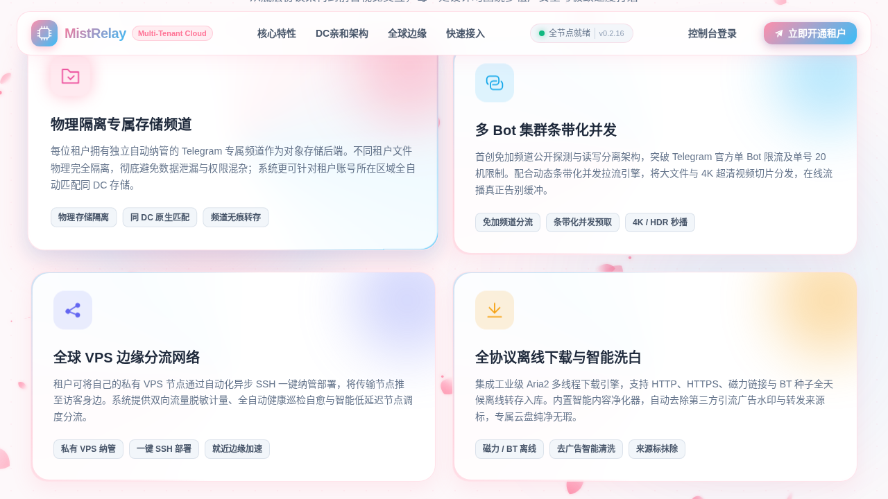
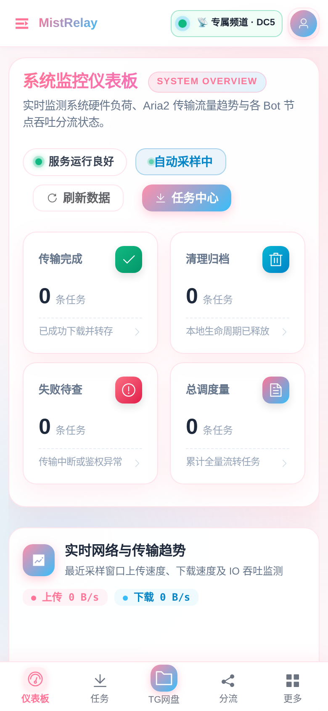
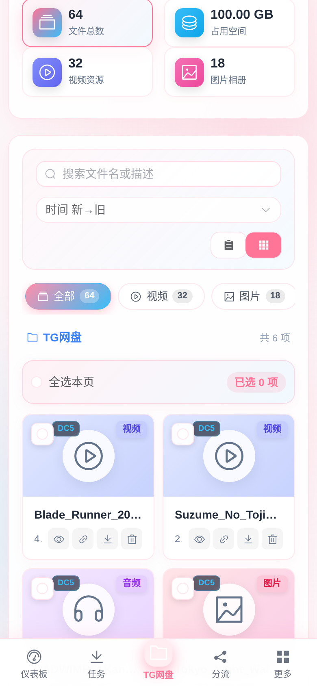
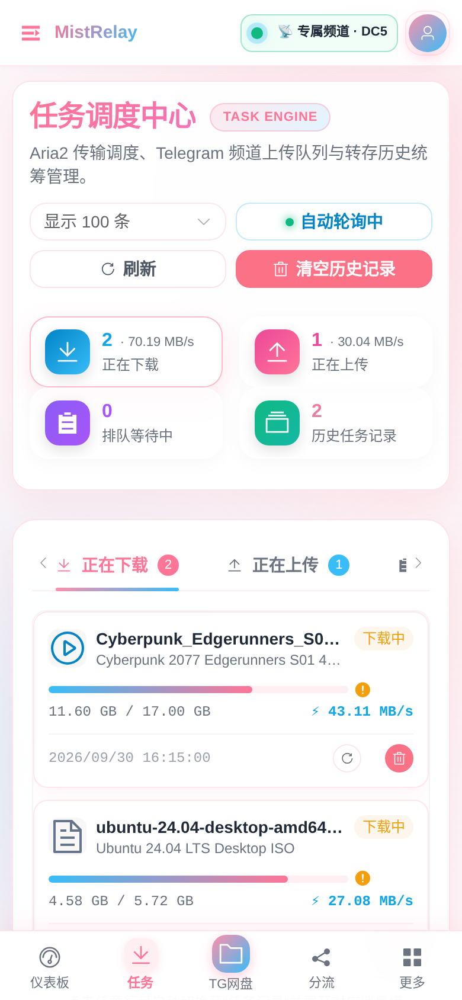
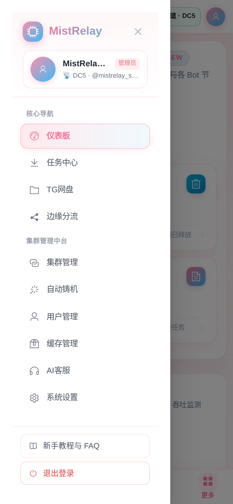

<div align="center">

# 🌸 MistRelay v3.0

**新一代多租户 Telegram 频道云盘 · 全球 VPS 边缘推流网络 · Aria2 智能下载中台**

[](https://github.com/qianlong520/Telegram_MistRelay/releases)
[](https://www.python.org/)
[](https://vuejs.org/)
[](Dockerfile)
[](tests/)
[](LICENSE)

</div>

---

## 📖 项目简介

**MistRelay v3.0** 是一个面向个人与多租户团队打造的企业级 Telegram 无限云盘、全球边缘流媒体分发与 Aria2 离线下载控制中台。

在 **v3.0** 重大版本中，系统完成了从单机工具向**分布式多租户云存储与边缘流媒体平台**的全面跃迁：将 **物理隔离的多租户专属存储频道**、**全球 VPS 边缘推流节点（Edge Streaming Worker）集群**、**Telegram Mini App (TMA) 免密生态**、**@BotFather 双模自动化扩缩容与协议号安全接管**、**2GB 浏览器大文件分片断点直传**、**私密/受限频道无痕洗白采集**、**三级不可变在线热备容灾** 以及 **Telegram 群专属 AI 智能客服** 深度整合于单个安全加固的容器架构中。

---

## ✨ 界面预览 (UI Showcase)

### 桌面端宇宙樱花流光门户与工作台
| 公开产品门户首屏 (`/`) | 架构矩阵与核心特性展示 |
| :---: | :---: |
|  |  |

### 移动端与 Telegram Mini App (TMA) 响应式体验
| 移动端仪表盘 (`/dashboard`) | 移动端云盘 (`/drive`) | 移动端任务中心 (`/downloads`) | 灵动抽屉导航 |
| :---: | :---: | :---: | :---: |
|  |  |  |  |

---

## 🚀 v3.0 十大核心架构特性

### 1. 🏢 多租户架构与专属存储频道物理隔离 (`/users`)
- **Telegram 验证码自助开通**：用户向主控 Bot 发送 `/register` 即可获取 6 位动态验证码，在 Web 登录页一键开通专属云盘并自选数据中心分区（DC1~DC5）；
- **专属频道全自动编排**：系统自动从协议号资产池调配对应 DC 的健康母号，创建物理隔离的专属存储频道（`@mr_u<id>_...`），并自动将集群 Bot 提升为频道管理员；
- **严格 RBAC 租户隔离**：普通租户仅能访问自有频道媒体、自有下载/上传任务及自建边缘节点，各租户流量、容量与文件索引完全隔离。

### 2. 🌐 全球 VPS 边缘推流节点集群与 302 动态 Ticket 路由 (`/edge-nodes`)
- **去中心化边缘直连推流 (`edge_worker/worker_server.py`)**：边缘 VPS 节点通过主控签发的 HMAC 防篡改时效 Ticket 校验请求，直接从 Telegram DC 拉取媒体分片并向播放器提供 HTTP Range 流式传输，彻底释放主控带宽；
- **异步 SSH 一键自动化纳管 (`vps_deployer.py`)**：填入 VPS IP 与 SSH 凭据，系统自动探测环境、下发微服务脚本、配置 systemd 守护进程与防火墙，并实时流式回传终端部署日志；
- **全方位网络基准诊断**：支持全球 5 大 Telegram DC 延迟矩阵探测、真实 MTProto 拉流测速、上下行带宽压测，并根据客户端真实 IP 与 DC 亲和度执行就近低延迟 302 智能路由。

### 3. 📱 Telegram Mini App (TMA) 无缝免密鉴权与移动端 PWA
- **TMA 零操作自动登录**：内置 `POST /api/auth/tma` 与 `tma.ts` WebApp 桥接，从 Telegram 菜单按钮打开即刻通过官方 `initData` HMAC-SHA256 签名完成免密鉴权与自动开户；
- **全场景移动端毛玻璃适配**：重构全站 11 个视图的移动端触控布局，配备底部毛玻璃导航栏 (`AppBottomNav.vue`)、抽屉菜单与 PWA 应用清单 (`manifest.webmanifest`)。

### 4. 🛡️ 在线一致性热备、三级不可变容灾与专属频道无损平移
- **三级不可变容灾体系 (`backup_manager.py`)**：
  - 基于 SQLite Online Backup API 实现零停机一致性热备，打包数据库、Session 凭据目录、JWT 密钥与配置；
  - 内置 `.immutable_baseline/` 只读基线保护、还原前自动生成 `safety_pre_restore_*` 快照、支持 `union` 非破坏性增量并集恢复与孤儿媒体自愈；
- **专属存储频道无损平移 (`channel_migrator.py`)**：当协议号母号风控或需迁移数据中心时，支持一键调配新协议号开通新频道，通过服务端 `copy_message` 极速无损镜像全部历史媒体并原子切换数据库指针，前台直链零感知过渡。

### 5. 📤 浏览器 2GB 大文件分片断点直传引擎 (`telegram_user_uploader.py`)
- **5MB 分片流式汇聚**：前端抽屉组件 (`DriveUploadDrawer.vue`) 支持多文件并发分片上传、实时速率与进度条监控，突破反向代理请求体大小限制，直达 Telegram 2GB 单文件上限；
- **智能分类投递**：汇聚完成后自动按视频、音频、图片或通用文档投递至租户专属存储频道，即时生成直链并触发后台缩略图抽帧。

### 6. 🤖 Telegram 群专属 AI 智能客服与出站安全护栏 (`/customer-service`)
- **群组智能应答 (`ai_customer_service.py`)**：支持在指定官方交流群内通过 `@机器人` 或引用回复触发解答，具备多轮会话滑动窗口记忆与一键铸造专属客服 Bot 能力；
- **运行态感知与出站脱敏**：动态注入脱敏后的集群在线节点数、流播状态与业务知识库；内置强力出站安全正则护栏，自动拦截并脱敏任何服务器 IP、Bot Token、API Key 与私钥。

### 7. ⚙️ @BotFather 自动化扩容流水线与协议号安全接管 (`/botfather`)
- **协议号资产池与安全接管**：支持手机号接码链接、Pyrogram/Telethon Session String 与 `.session` 文件批量导入；支持一键踢出其他登录设备、自动设置/修改 2FA 云密码、取消账号注销重置；
- **家宽住宅代理自动提取 API 凭据**：按协议号国家/地区智能匹配住宅代理自动登录 `my.telegram.org` 提取 `api_id` 与 `api_hash`；
- **双模铸造与零停机热插拔**：支持多号接力扩容（突破单号 20 个 Bot 限制）与单号精准模式，新铸造 Bot 秒级热挂载入网参与调度。

### 8. ⚡ Telegram 动态数据中心（DC1~DC5）三级亲和调度与免加频道集群 (`/bots`)
- **免加频道公开 Handle 自动解析**：从机 Worker 无需逐一拉入频道，自动通过公开标识解析 Peer 并激活只读分流模式（`no_join_resolved`）；
- **DC 三级亲和评分与单流多 Bot 条带化**：按 `同区原生 (0.0) -> 热会话复用 (0.8) -> 跨区溢出 (2.0)` 智能选路，大文件与高清视频优先聚合目标 DC 节点并发条带拉取，彻底消除跨洋队头阻塞与播放微卡顿；
- **Pyrogram 64 位频道 ID 热补丁 (`pyrogram_patch.py`)**：彻底解决新型 64 位频道 ID（`-1004056...`）与新版 TL 构造器引发的崩溃问题。

### 9. 🕵️ 私密/受限频道自动化采集与无痕洗白转存 (`private_channel_harvester.py`)
- **双模采集引擎**：支持解析 `t.me/c/<id>/<start>-<end>` 连号区间与私密群邀请链接；未受限频道采用 `fast_copy` 零流量秒传，开启“禁止转发/保存”的受限频道自动启用 `restricted_relay` 底层流式破除限流并重传；
- **无痕洗白与归属改写**：自动抹除“转发自”来源头，精准剔除原配文与文件名中的第三方广告、`@username` 与外链，并动态追加本频道签名。

### 10. 🎬 二次元流光毛玻璃云盘 (`/drive`)、缩略图预热与缓存治理 (`/cache`)
- **影院级在线播放**：自适应视口黄金高度弹窗、网页全屏/窗口切换、剧集自动连播、快捷键控制、画中画 (PiP)，一键唤起 PotPlayer / VLC / IINA 及导出 `#EXTM3U` 播放列表；
- **后台静默缩略图预热 (`TelegramThumbnailWorker`)**：常驻低速扫描与新文件即时入队生成 WebP 封面，实现网盘封面秒开；
- **高安全缓存治理 (`/cache`)**：支持 Dry-run 试运行测算，严格保护 Aria2 与数据库进行中任务。

---

## 🛠️ 快速开始 (Quick Start)

### 1. 准备基础参数
- `API_ID` / `API_HASH`: 从 [my.telegram.org](https://my.telegram.org) 获取的 Telegram API 凭据。
- `BOT_TOKEN`: 从 `@BotFather` 创建的主控 Bot Token。
- `ADMIN_ID`: 超级管理员的 Telegram 数字用户 ID。
- `BIN_CHANNEL`: 默认主存储频道 ID（以 `-100` 开头，需将主控 Bot 设为频道管理员）。

### 2. 克隆仓库与初始化配置

```bash
git clone https://github.com/qianlong520/Telegram_MistRelay.git
cd Telegram_MistRelay
cp db/config.yml.example db/config.yml
chmod 0600 db/config.yml
```

编辑 `db/config.yml` 填入核心配置：

```yaml
API_ID: your_api_id
API_HASH: your_api_hash
BOT_TOKEN: your_bot_token
ADMIN_ID: 123456789
BIN_CHANNEL: -100xxxxxxxxxx

UP_TELEGRAM: true
SAVE_PATH: /data/downloads
DOWNLOAD_CLEANUP_ENABLED: true
DOWNLOAD_RETENTION_HOURS: 24
DOWNLOAD_CLEANUP_INTERVAL_SECONDS: 3600

RPC_SECRET: "<使用 openssl rand -hex 32 生成>"
RPC_URL: localhost:6800/jsonrpc

ENABLE_STREAM: true
STREAM_PORT: 8080
STREAM_BIND_ADDRESS: 0.0.0.0
STREAM_FQDN: your-domain.example.com
STREAM_ALLOWED_USERS: "123456789"
```

### 3. Docker Compose 安全部署

```bash
# 创建持久化目录并赋权给容器非特权用户 (UID/GID 10001)
install -d -m 0750 db db/backups db/sessions downloads cache/thumbnails
chown -R 10001:10001 db downloads cache/thumbnails
chmod 0600 db/config.yml

# 生成首次管理员强密码文件（登录成功后系统将自动安全擦除该文件）
umask 077
openssl rand -base64 24 | tr -d '\r\n' > db/admin-password
chmod 0400 db/admin-password
chown 10001:10001 db/admin-password

# 构建并启动容器
docker compose up -d --build
```

启动完成后访问 `http://127.0.0.1:8080`：
- `/`：查看公开产品门户与系统实时就绪状态；
- `/login`：使用管理员账号 `admin` 与 `db/admin-password` 中的初始密码登录管理工作台，或切换至「Telegram 验证码注册」开通租户专属云盘。

---

## 🗺️ Web 中台导航地图

| 路由路径 | 模块名称 | 核心职责与能力 | 角色权限 |
| :--- | :--- | :--- | :---: |
| `/` | **官方展示门户** | 宇宙樱花动态背景、3D 视差工作台预览、DC 矩阵与快速引导 | 公开访问 |
| `/login` | **统一认证中心** | 账号密码登录、Telegram `/register` 验证码自助注册、TMA 免密跳板 | 公开访问 |
| `/dashboard` | **系统监控仪表盘** | 实时传输速率曲线（ECharts）、集群负载、网盘容量与任务概览 | 管理员 / 租户 |
| `/drive` | **TG 频道云盘** | 网格/列表双视图、2GB 分片上传、私密频道采集、影院连播、M3U 导出 | 管理员 / 租户 |
| `/downloads` | **下载与任务中心** | HTTP/磁力/种子投递、Aria2 实时进度、TG 自动转存队列管理 | 管理员 / 租户 |
| `/edge-nodes` | **边缘推流节点** | 全球 VPS 节点纳管、SSH 一键部署、DC 延迟矩阵与全双工测速诊断 | 管理员 / 租户 |
| `/bots` | **机器人集群中心** | 免加频道负载均衡池、DC1~DC5 亲和矩阵、单流/多流实战基准测速 | 管理员 |
| `/botfather` | **自动铸机与协议号** | 协议号池、2FA 安全接管、家宽代理提参、多号接力铸机与零停机热插拔 | 管理员 |
| `/users` | **多租户与容灾中心** | 租户开户、专属频道自动分配、频道无损平移、全量热备与增量并集还原 | 管理员 |
| `/customer-service` | **AI 智能客服中台** | Telegram 群 @唤醒配置、Prompt 知识库编排、在线沙箱调试与脱敏审计 | 管理员 |
| `/cache` | **缓存与存储治理** | 磁盘空间仪表、缩略图/下载目录分类清理、Dry-run 试运行与生命周期策略 | 管理员 |
| `/settings` | **系统设置与容器运维** | 全模块参数热配置、多租户注册策略、Docker 状态自检与实时暗色日志终端 | 管理员 |

完整后端 RESTful API 契约详见：[`docs/backend-api.md`](docs/backend-api.md)。

---

## 🔒 研发安全规范与自动化测试

本项目内置严格的**三层数据安全防线**与**沙箱测试契约**（详见 [`AGENTS.md`](AGENTS.md) 与 [`SAFETY_RULES.md`](SAFETY_RULES.md)）：
1. **内核级测试阻断防护**：`db.py` 内置 SQLite `_test_mode_authorizer` 钩子，任何测试环境若尝试对生产数据库执行写操作将被底层引擎直接拦截；
2. **全局测试自动沙箱**：`tests/conftest.py` 自动将所有测试会话重定向至独立临时 SQLite 实例并在测试后自动销毁；
3. **三级灾备不可变保护**：`backup_manager.py` 强制保护核心基线与 `safety_` 前缀快照，拒绝任何误删操作。

### 运行后端测试套件
```bash
# 执行全量 353 项沙箱单元测试与集成测试
python3 -m unittest discover -s tests -p "test_*.py" -t .
```

### 运行前端类型检查与构建
```bash
cd web
npm install
npm run type-check
npm run build
npx playwright test
```

---

## 📄 开源协议与致谢

本项目基于 [MIT License](LICENSE) 开源。

感谢以下优秀开源项目的启发与基础支持：
- [Pyrogram](https://github.com/pyrogram/pyrogram) & [Telethon](https://github.com/LonamiWebs/Telethon)
- [TG-FileStreamBot](https://github.com/rong6/TG-FileStreamBot)
- [HouCoder/tele-aria2](https://github.com/HouCoder/tele-aria2)
- [jw-star/aria2bot](https://github.com/jw-star/aria2bot)
